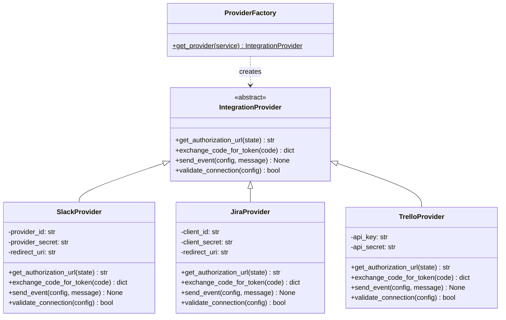
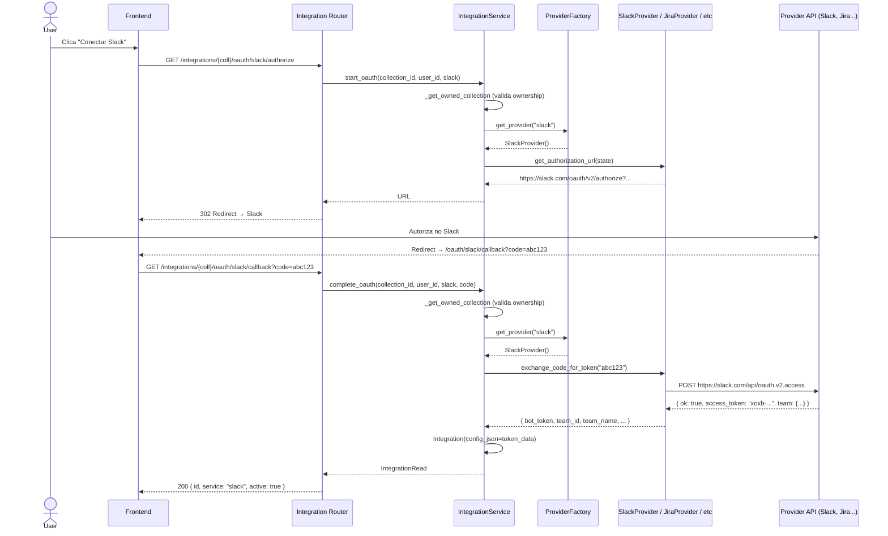
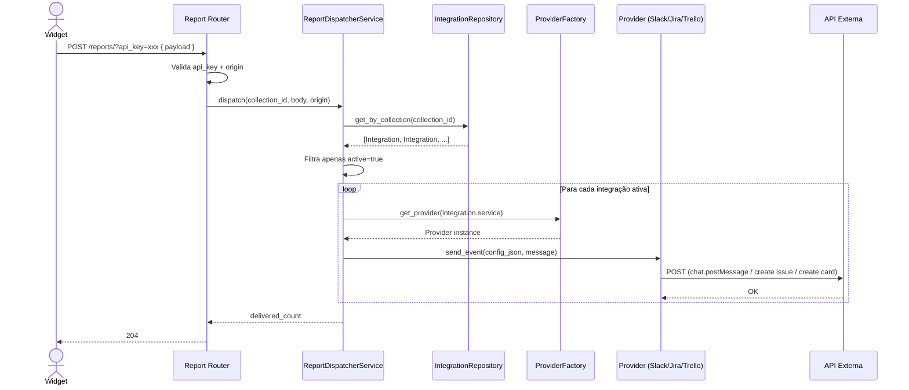

# Integrations & Providers — FeedFlow

## Visão Geral

O FeedFlow conecta collections a serviços externos (Slack, Jira, Trello) por meio de **integrações**. Cada integração armazena credenciais e configurações específicas do provider em um campo JSON único (`config_json`), sem necessidade de tabelas separadas por serviço.

---

## Arquitetura

### Camadas

```
Router (integration_router)
  │
  ├─ IntegrationService          ← orquestra CRUD + OAuth
  │     │
  │     ├─ IntegrationRepository ← persistência (SQLModel/PostgreSQL)
  │     └─ ProviderFactory       ← instancia o provider correto
  │           │
  │           ├─ SlackProvider
  │           ├─ JiraProvider
  │           └─ TrelloProvider
  │
  └─ ReportDispatcherService     ← despacha reports para integrações ativas
        │
        └─ ProviderFactory → provider.send_event(config, message)
```

### Diagrama de classes (Provider Pattern)



---

## Model: Integration

| Campo           | Tipo                | Descrição                                                        |
|-----------------|---------------------|------------------------------------------------------------------|
| `id`            | UUID (PK)           | Identificador único                                              |
| `collection_id` | UUID (FK)           | Collection dona da integração                                    |
| `service`       | Enum                | `slack` \| `jira` \| `trello`                                   |
| `active`        | bool                | Se a integração está ativa para despacho                         |
| `config_json`   | JSON                | Credenciais e config específicas do provider (ver tabela abaixo) |
| `external_id`   | str (opcional)      | ID externo no provider (ex.: workspace_id)                       |
| `created_at`    | datetime            | Data de criação                                                  |
| `updated_at`    | datetime            | Data de última atualização                                       |

### Conteúdo do `config_json` por provider

| Provider | Campos esperados                                         |
|----------|----------------------------------------------------------|
| Slack    | `bot_token`, `channel_id`, `team_id`, `team_name`       |
| Jira     | `access_token`, `cloud_id`, `project_key`                |
| Trello   | `token`, `list_id`                                       |

> **Decisão de design:** optamos por manter tudo no `config_json` (desnormalizado) porque o JSON nunca é filtrado/indexado pelo banco — ele é um blob opaco passado diretamente ao provider. Isso elimina migração a cada novo provider e mantém o dispatcher genérico.

---

## Rotas

### CRUD

| Método   | Rota                                          | Descrição                         |
|----------|-----------------------------------------------|-----------------------------------|
| `POST`   | `/integrations/{collection_id}`               | Criar integração manual           |
| `GET`    | `/integrations/{collection_id}`               | Listar integrações da collection  |
| `DELETE` | `/integrations/{collection_id}/{integration_id}` | Remover integração             |

### OAuth

| Método | Rota                                                          | Descrição                                              |
|--------|---------------------------------------------------------------|--------------------------------------------------------|
| `GET`  | `/integrations/{collection_id}/oauth/{provider}/authorize`    | Redireciona (302) para consent screen do provider      |
| `GET`  | `/integrations/{collection_id}/oauth/{provider}/callback`     | Troca code por tokens, cria integração com config_json |

Todas as rotas exigem **JWT Bearer + ownership da collection**.

---

## Fluxo OAuth (authorize → callback → integração criada)



---

## Fluxo de Despacho de Reports



---

## Como adicionar um novo provider

1. **Criar arquivo** em `backend/app/provider/services/` (ex.: `discord_provider.py`)
2. **Implementar** a interface `IntegrationProvider` (4 métodos obrigatórios)
3. **Registrar** no enum `IntegrationService` em `backend/app/models/enums/integrationsServices.py`
4. **Registrar** na `ProviderFactory` em `backend/app/provider/provider_factory.py`
5. **Nenhuma migração de banco** necessária — `config_json` aceita qualquer schema

---

## Variáveis de ambiente por provider

| Provider | Variáveis                                                     |
|----------|---------------------------------------------------------------|
| Slack    | `SLACK_CLIENT_ID`, `SLACK_CLIENT_SECRET`, `SLACK_REDIRECT_URI` |
| Jira     | `JIRA_CLIENT_ID`, `JIRA_CLIENT_SECRET`, `JIRA_REDIRECT_URI`   |
| Trello   | `TRELLO_API_KEY`, `TRELLO_API_SECRET`                          |

---

## Arquivos relacionados

| Arquivo                                            | Responsabilidade                       |
|----------------------------------------------------|----------------------------------------|
| `app/models/integrations.py`                       | Model SQLModel da integração           |
| `app/models/enums/integrationsServices.py`         | Enum dos providers suportados          |
| `app/routes/integration_router.py`                 | Rotas CRUD + OAuth                     |
| `app/services/integrations/integrations_service.py`| Lógica de negócio (CRUD + OAuth)       |
| `app/repositories/integration_repository.py`       | Persistência                           |
| `app/provider/base_provider.py`                    | Interface abstrata dos providers       |
| `app/provider/provider_factory.py`                 | Factory que instancia providers        |
| `app/provider/services/slack_provider.py`          | Provider Slack (App + Bot)             |
| `app/provider/services/jira_provider.py`           | Provider Jira                          |
| `app/provider/services/trello_provider.py`         | Provider Trello                        |
| `app/services/widget/report_dispatcher_service.py` | Despacho de reports para integrações   |
| `app/dtos/schemas.py`                              | DTOs (IntegrationEnable, IntegrationRead) |
