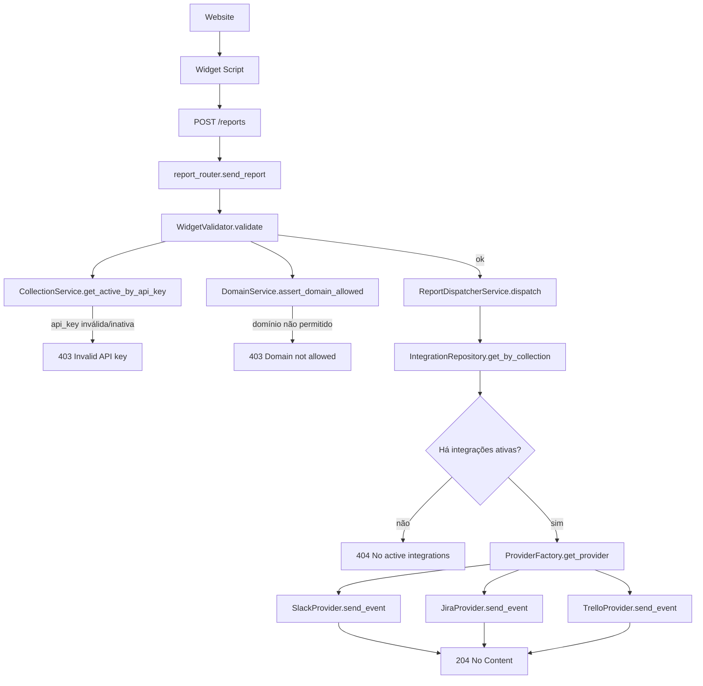

# FeedFlow Widget

## Visão geral
O FeedFlow Widget permite coletar feedback visual em sites de terceiros, com:
- botão flutuante;
- modal de feedback;
- captura de screenshot;
- envio para API com metadados técnicos.

O widget suporta dois modos:
- **Auto-init** via atributos `data-*` na tag `<script>`;
- **Init manual** via `FeedFlowWidget.init(...)`.

## Uso no site (integração)

### Produção
```html
<script
  src="https://seu-dominio.com/static/widget.js"
  data-api-token="SEU_TOKEN_AQUI"
  data-api-url="https://api.seu-dominio.com/api/v1"
  data-button-text="Reportar Problema"
  data-button-position="bottom-right"
  data-primary-color="#4F46E5"
></script>
```

### Desenvolvimento local
```html
<script
  src="http://localhost:8000/static/widget.js"
  data-api-token="SEU_TOKEN_AQUI"
  data-api-url="http://localhost:8000/api/v1"
  data-button-text="Reportar Problema"
  data-button-position="bottom-right"
  data-primary-color="#4F46E5"
></script>
```

## Parâmetros suportados
- `data-api-token` (obrigatório): API key da collection (enviada como `api_key`).
- `data-api-url` (obrigatório): base URL da API.
- `data-button-text` (opcional): texto do botão.
- `data-button-position` (opcional): `bottom-right`, `bottom-left`, `top-right`, `top-left`.
- `data-primary-color` (opcional): cor primária do botão/modal.
- `data-language` (opcional): idioma (default `pt-BR`).
- `data-domain` (opcional): domínio de referência.

## Estrutura do widget (Vite)
Código fonte modular:

```text
widget/
├── package.json
├── vite.config.js
└── src/
    ├── main.js          # Orquestração e ciclo completo
    ├── config.js        # Leitura dos atributos data-*
    ├── button.js        # Botão flutuante
    ├── modal.js         # Modal, eventos e drag
    ├── screenshot.js    # Captura com html2canvas
    ├── fullscreen.js    # Visualização fullscreen do preview
    ├── utils.js         # Validação, status, metadados
    └── styles.css       # Estilos do widget
```

Artefato final para distribuição:
- `backend/app/static/widget.js`

## Como funciona internamente
1. O widget é carregado no site por `<script src=".../static/widget.js">`.
2. `main.js` monta `window.FeedFlowWidget` e tenta auto-init via `data-*`.
3. Ao abrir modal, usuário preenche e-mail + descrição.
4. Captura screenshot via `html2canvas` (preview opcional + fullscreen).
5. Envio para `POST {apiUrl}/reports?api_key={data-api-token}` com `application/json`.
6. Payload enviado:
  - `title`: string fixa (`"Widget report"`)
  - `message`: descrição digitada pelo usuário
  - `email`: e-mail digitado pelo usuário
  - `page`: URL atual da página
  - `metadata`: objeto técnico coletado pelo widget
  - `has_screenshot`: `true/false` (neste momento a imagem não é enviada no body)

## Implementação e build


npm install && npm run test && npm run build

### 1) Instalar dependências
Na pasta `widget`:

```bash
npm install
```

### 2) Build de produção
```bash
npm run build
```

Com a configuração atual do Vite (`widget/vite.config.js`), o bundle é gerado direto em:
- `backend/app/static/widget.js`

### 3) Servir no backend
O backend já expõe estáticos em `/static`, então o widget fica disponível em:
- `http://localhost:8000/static/widget.js`

## Testes do widget

Os testes automatizados do widget ficam na pasta `widget/tests` e usam Vitest + jsdom.

### 1) Instalar dependências
Na pasta `widget`:

```bash
npm install
```

### 2) Executar testes (uma vez)
```bash
npm run test
```

### 3) Executar testes em modo watch
```bash
npm run test:watch
```

### 4) Executar cobertura de testes
```bash
npm run test:coverage
```

### Resultado esperado
- Todos os testes devem passar.
- O relatório de cobertura aparece no terminal.
- O relatório HTML de cobertura é gerado pelo Vitest para inspeção detalhada.

### Escopo atual dos testes
- `config.js`: leitura dos atributos `data-*`.
- `utils.js`: validação, status e metadados.
- `screenshot.js`: captura e tratamento de erro no `toBlob`.
- `modal.js`: renderização da estrutura, eventos e drag.
- `main.js`: auto-init, API pública (`open`/`close`) e abertura via botão.

### Próximo passo recomendado
Expandir cenários de integração (submit completo, mensagens de erro da API e fluxo de screenshot + envio) para aumentar cobertura de fluxos críticos de UI.

## Execução em produção

Fluxo recomendado:
1. Rodar build do widget (`npm run build`).
2. Garantir que o arquivo atualizado `backend/app/static/widget.js` está no deploy.
3. Subir backend (container/infra padrão do projeto).
4. Integrar o script no site cliente com `data-api-token` e `data-api-url` corretos.
5. Validar envio real de feedback em ambiente de produção.

## Observações importantes
- O arquivo original legado do widget foi mantido para comparação/análise.
- A versão modular mantém a mesma lógica funcional, com organização por responsabilidade.
- Para CSP mais restrita, o bundle com `html2canvas` empacotado evita dependência externa de CDN.

## Módulos de contexto e captura técnica

O widget coleta contexto técnico do bug automaticamente, incluindo:

### Navegação
- Exposto por: `getNavigationContext()`
- Retorno:
```js
{
  url: window.location.href, // URL completa
  path: window.location.pathname // Caminho
}
```
- Sempre seguro, nunca lança erro.

### Console (logs, warnings, erros, info)
- Instrumentação automática via `instrumentConsole()`
- Bufferiza últimos 50 eventos (FIFO, circular buffer)
- Cada entrada:
```js
{
  level: 'log' | 'warn' | 'error' | 'info',
  message: string, // até 1000 caracteres
  timestamp: number, // ms
  source: 'console'
}
```
- Exposto por: `getConsoleBuffer()`
- Não quebra comportamento original do console.
- Idempotente e seguro para múltiplas chamadas.

### Erros globais
- Instrumentação via `instrumentGlobalErrors()`
- Captura:
  - `window.onerror` (source: 'window.onerror')
  - `window.onunhandledrejection` (source: 'unhandledrejection')
- Entradas vão para o mesmo buffer do console.

### Falhas de rede (fetch/XHR)
- Instrumentação via `instrumentNetwork()`
- Bufferiza últimos 50 requests falhos (status >= 400 ou erro de rede)
- Cada entrada:
```js
{
  type: 'fetch' | 'xhr',
  method: string,
  url: string,
  status: number | null,
  duration: number, // ms
  success: boolean,
  error?: string,
  timestamp: number
}
```
- Exposto por: `getNetworkBuffer()`
- Não bloqueia requests, idempotente, seguro.

## Exemplo de uso dos módulos

```js
import { getNavigationContext } from './context.js';
import { instrumentConsole, getConsoleBuffer } from './consoleBuffer.js';
import { instrumentGlobalErrors } from './errorBuffer.js';
import { instrumentNetwork, getNetworkBuffer } from './networkBuffer.js';

// Inicializar instrumentações (idempotentes)
instrumentConsole();
instrumentGlobalErrors();
instrumentNetwork();

// Coletar contexto para envio
const contexto = {
  navigation: getNavigationContext(),
  console: getConsoleBuffer(),
  network: getNetworkBuffer()
};
```

## Testes automatizados dos módulos de contexto

Os testes ficam em `widget/src/*.test.js` e cobrem:
- Navegação: segurança e retorno correto
- Console: bufferização, truncamento, idempotência
- Erros globais: captura e idempotência
- Rede: bufferização de falhas, idempotência

Para rodar:
```bash
npm run test
```

Todos os testes devem passar. O relatório de cobertura pode ser gerado com:
```bash
npm run test:coverage
```

## Retorno dos métodos

- `getNavigationContext()`: `{ url, path }`
- `getConsoleBuffer()`: `ConsoleEntry[]`
- `getNetworkBuffer()`: `NetworkEntry[]`

Todos os métodos são seguros, nunca lançam exceção e podem ser chamados a qualquer momento.

## Fluxo de reports (sem rate limit)

Este é o fluxo atual do endpoint `POST /reports` no backend:



### Módulos envolvidos

- `app/routes/report_router.py`: entrada HTTP, extração de `origin`, mapeamento de erros HTTP.
- `app/services/widget/widget_validators.py`: valida `api_key` e domínio, retorna `collection` somente se ambas passarem.
- `app/services/widget/report_dispatcher_service.py`: busca integrações ativas e despacha para providers.
- `app/provider/provider_factory.py`: resolve provider por serviço (`slack`, `jira`, `trello`).
- `app/provider/services/*_provider.py`: implementação concreta do envio (`send_event`).